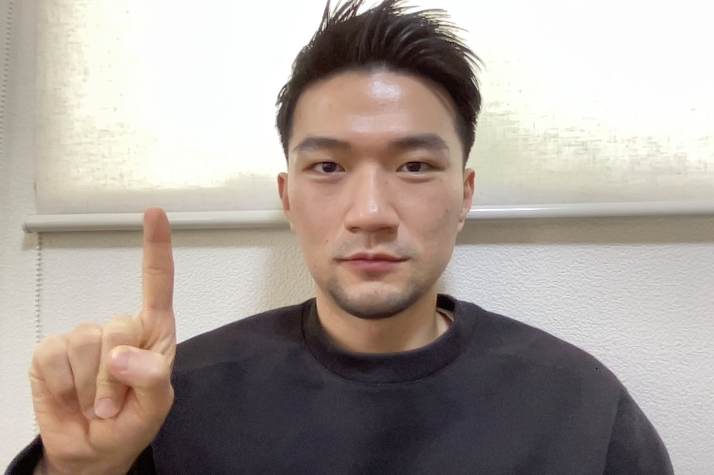
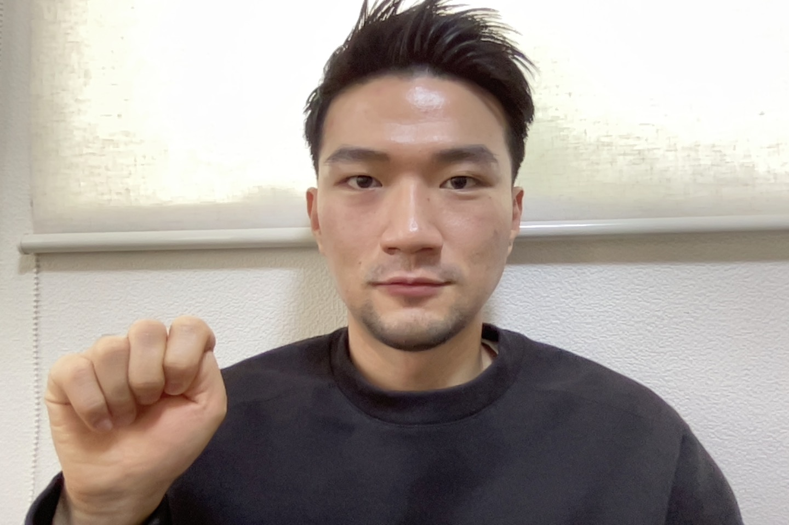

PREREQ  
You need to install:  
1. pygame  
2. mediapipe  
3. opencv  
4. numpy 
5. pynput

SCRIPTS TO RUN  
%run ./hand.py  
%run ./main.py  

Make sure the two programs are running  

Start the game with enter and you can play with either:  
1. your keyboard (make sure your hands are outside the frame)  
2. your right hand (make sure your right hand is in the frame)  

Put your index finger straight up for up motion:  

Put your index finger down for down motion:  

Tilt your index finger towards the left for left motion:  

Tilt your index finger towards the right for right motion:  

