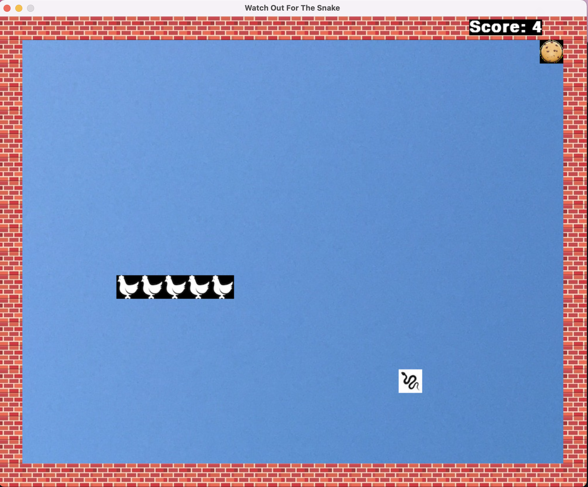

<!-- PROJECT LOGO -->
<br />
<div align="center">
  <a href="https://github.com/brianlee9090/watch-out-for-the-snake">
    
    
    
  </a>

<h3 align="center">Watch Out For The Snake</h3>
</div>

<!-- ABOUT THE PROJECT -->
## About The Project

Do you like Snake? You sure will enjoy this game. This readme will walk you through how to install, how to play the classic game with a fun twist!
<p align="right">(<a href="#top">back to top</a>)</p>

### Built With

* [Pygame](https://www.pygame.org/)
* [MediaPipe](https://mediapipe.dev)
* [Numpy](https://numpy.org)
* [OpenCV](https://opencv.org)
* [Pynput](https://pynput.readthedocs.io)


<!-- GETTING STARTED -->
## Getting Started

To get a local copy up and running follow these simple steps.

### Prerequisites

Please have Python 3(https://www.python.org/downloads/) and pip(https://packaging.python.org/en/latest/key_projects/#pip) before the below installation.

### Installation

1. Clone the repo:
   ```sh
   git clone https://github.com/brianlee9090/watch-out-for-the-snake.git
   ```
2. pip install the used libraries:
* [Pygame](https://www.pygame.org/)
* [MediaPipe](https://mediapipe.dev)
* [Numpy](https://numpy.org)
* [OpenCV](https://opencv.org)
* [Pynput](https://pynput.readthedocs.io)

<p align="right">(<a href="#top">back to top</a>)</p>


## Game instructions

### How to start the game
1. To start the game with enter and you can play with either:  
I. your keyboard (make sure your hands are outside the frame)  
II. your right hand (make sure your right hand is in the frame)  

2. Scripts to run:
I. To play the game with your keyboard please step this step and go to step II.
   To play the game with your finger, %run ./hand.py.
   Make sure the both programs are running.
II. %run ./main.py to start the game

### How to play
You are the <text color="green" font-weight="bold">chicken</text> and your goal is to eat as many <text color="blue" font-weight="bold">cookies</text> as possible while avoiding the <text color="red" font-weight="bold">snake</text>. 
Some things to keep in mind:
1. Your chicken gets 1 extra chicken friend everytime it eats a cookie
2. As your chicken army grows, your line of chickens moves faster.
3. The snake is smart so it changes position if you succeed in avoiding it.

### End of game
The game ends when:
1. Your chicken hits the snake
2. Your chicken hits any of the walls
3. Your chicken hits one of its friends

### How to operate the game
1. Finger controls:
<ul>
<li>
 <text align-text="center">Put your index finger straight up for up motion:</text><br>
 
</li>
<li>
 <text align-text="center">Put your index finger down for down motion</text><br>
 
</li>
<li>
 <text align-text="center">Tilt your index finger towards the left for left motion</text><br>
 
</li>
<li>
 <text align-text="center">Tilt your index finger towards the right for right motion</text><br>
 
</li>
<br>
2. Keyboard controls:
Use the "up", "down", "left", "right" keys to play

<p align="right">(<a href="#top">back to top</a>)</p>


<!-- USAGE EXAMPLES -->
## Usage

Use this space to show useful examples of how a project can be used. Additional screenshots, code examples and demos work well in this space. You may also link to more resources.

_For more examples, please refer to the [Documentation](https://example.com)_

<p align="right">(<a href="#top">back to top</a>)</p>


<!-- CONTRIBUTING -->
## Contributing

Contributions are what make the open source community such an amazing place to learn, inspire, and create. Any contributions you make are **greatly appreciated**.

If you have a suggestion that would make this better, please fork the repo and create a pull request. You can also simply open an issue with the tag "enhancement".
Don't forget to give the project a star! Thanks again!

1. Fork the Project
2. Create your Feature Branch (`git checkout -b feature/AmazingFeature`)
3. Commit your Changes (`git commit -m 'Add some AmazingFeature'`)
4. Push to the Branch (`git push origin feature/AmazingFeature`)
5. Open a Pull Request

<p align="right">(<a href="#top">back to top</a>)</p>


<!-- CONTACT -->
## Contact

Brian Lee - [linkedIn](https://www.linkedin.com/in/brianlee9090/)

Project Link: [https://github.com/brianlee9090/watch-out-for-the-snake](https://github.com/brianlee9090/watch-out-for-the-snake)

<p align="right">(<a href="#top">back to top</a>)</p>


<!-- MARKDOWN LINKS & IMAGES -->
<!-- https://www.markdownguide.org/basic-syntax/#reference-style-links -->
[forks-shield]: https://img.shields.io/github/forks/brianlee9090/watch-out-for-the-snake.svg?style=for-the-badge
[forks-url]: https://github.com/brianlee9090/watch-out-for-the-snake/network/members
[stars-shield]: https://img.shields.io/github/stars/brianlee9090/watch-out-for-the-snake.svg?style=for-the-badge
[stars-url]: https://github.com/brianlee9090/watch-out-for-the-snake/stargazers

[linkedin-shield]: https://img.shields.io/badge/-LinkedIn-black.svg?style=for-the-badge&logo=linkedin&colorB=555
[linkedin-url]: https://linkedin.com/in/brianlee9090
[product-screenshot]: resources/screenshot.png


